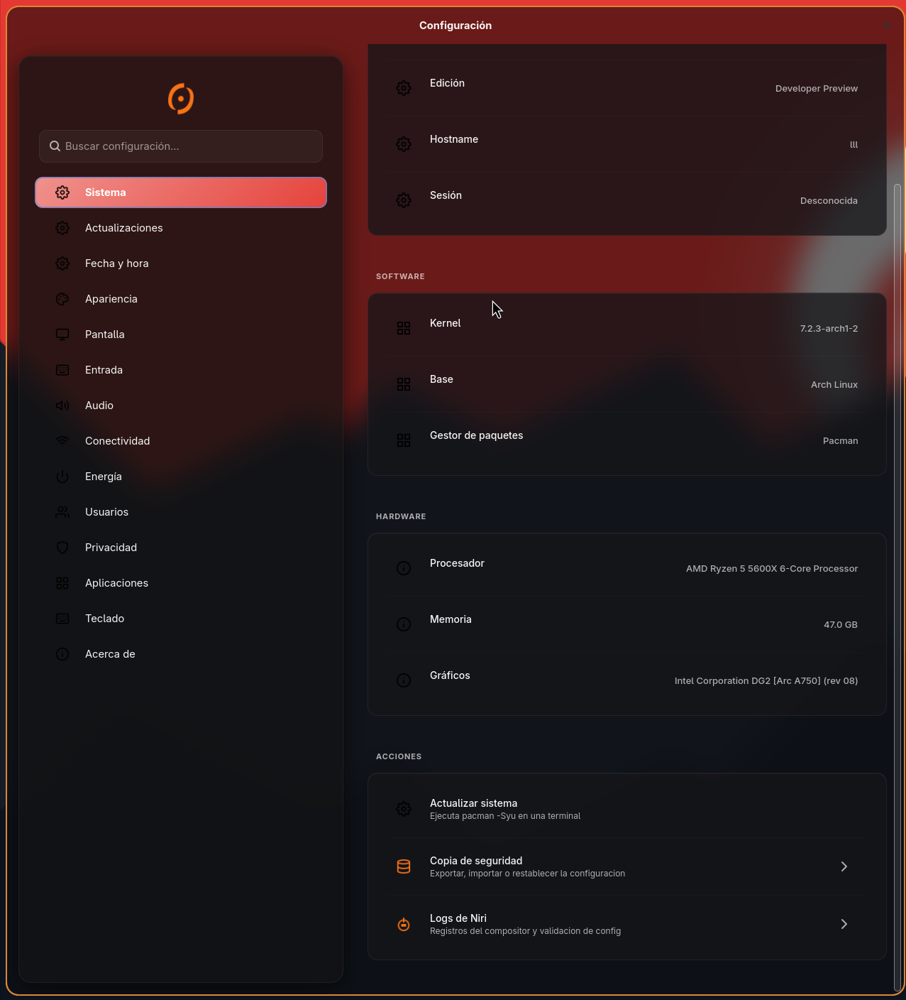
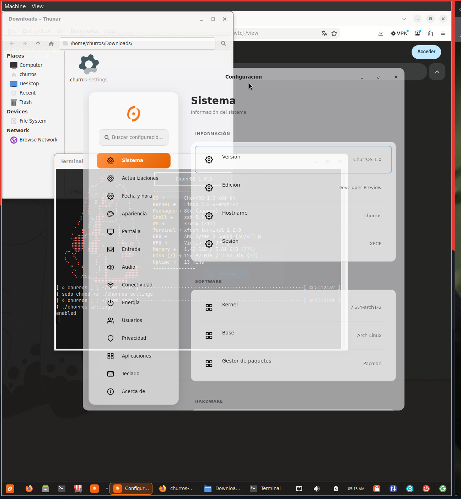
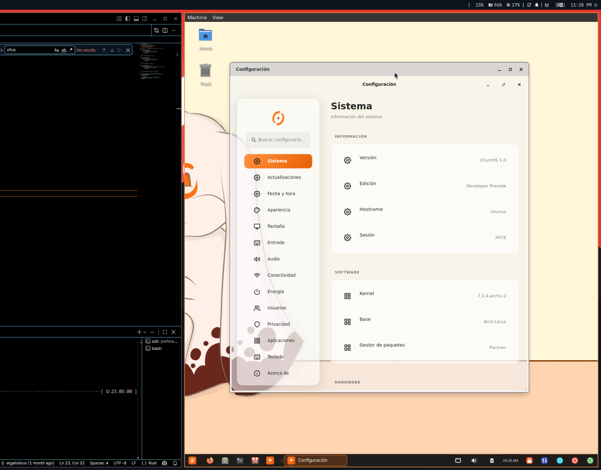

# 67 fix paywall

1. se corrigio el problema del efecto glass de la aplicacion de preferencias
``` 
NIRI
```


```
XFCE  
```


observe como en la edicion de XFCE no sale doble header bar, esto se consiguio con

```
let _is_xfce = churros_services::version::edition().contains("xfce");
	if _is_xfce {
		window.set_decorated(false);
	}
```
si no se hace esto entonces la ventana termina siendo muy poco estetica


# correcion del problema de pywal
1. El problema principal es el cierre de las aplicaciones lanzadas desde fuzzel cuando se activa o desactiva colores dinamicos

la solucion a este problema es la modificacion de ~/.config/fuzzel/fuzzel.ini para anadir en [main]

```
launch-prefix=setsid -f
```
2. por que se cerraban las aplicaciones al hacer reincio de waybar?
	1. Debido a que las aplicaciones se abrian como hijo de fuzzel que a su vez era hijo de waybar lo que provocaba el cierre de TODAS las aplicaciones que se hayan abierto con el launcher
	2. la solucion lanza los procesos de forma independiente provocando que el reinicio de waybar no afecte a las aplicaciones lanzadas desde fuzzel 